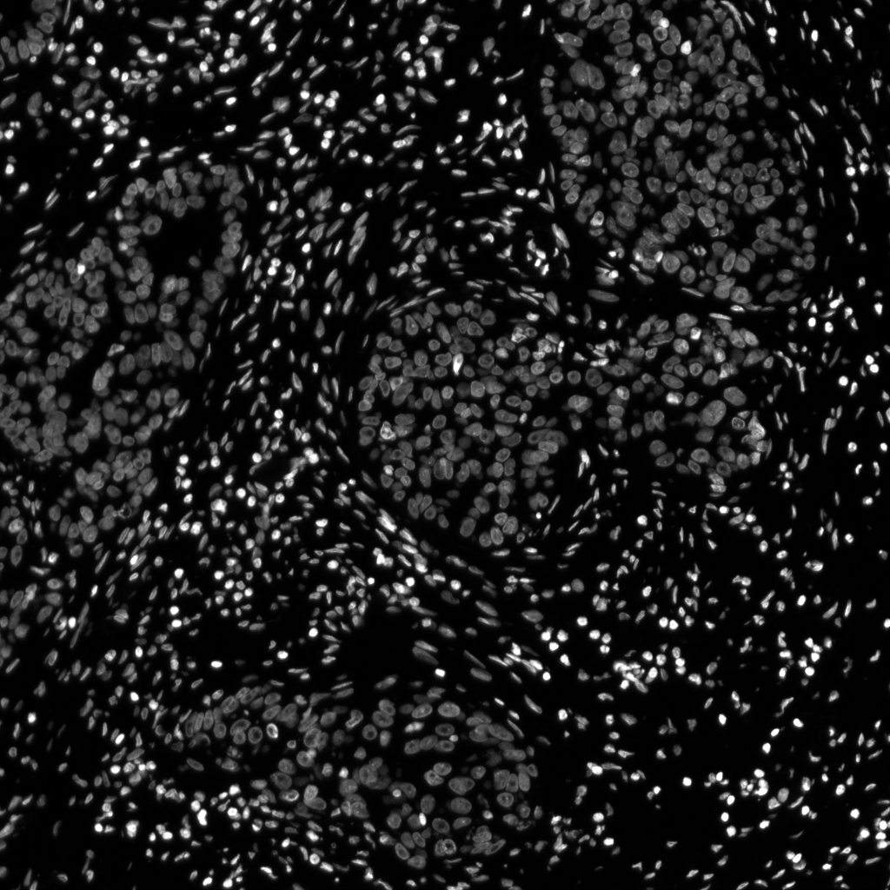
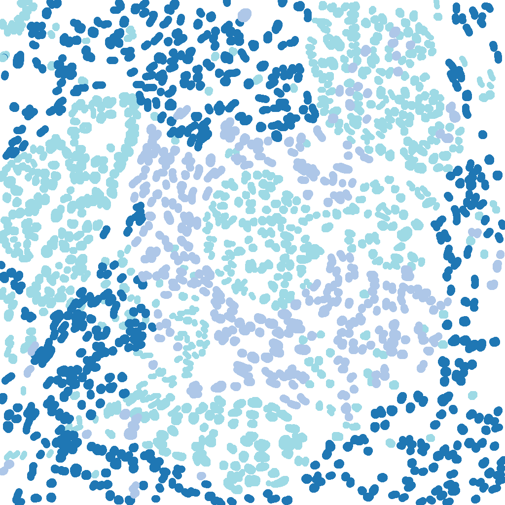
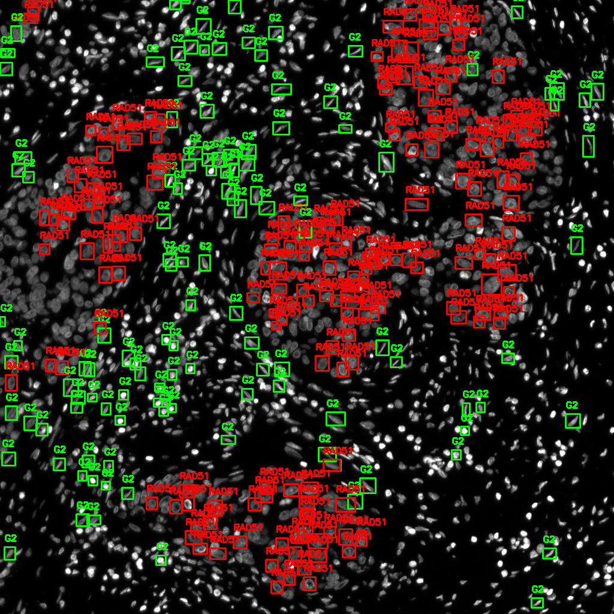
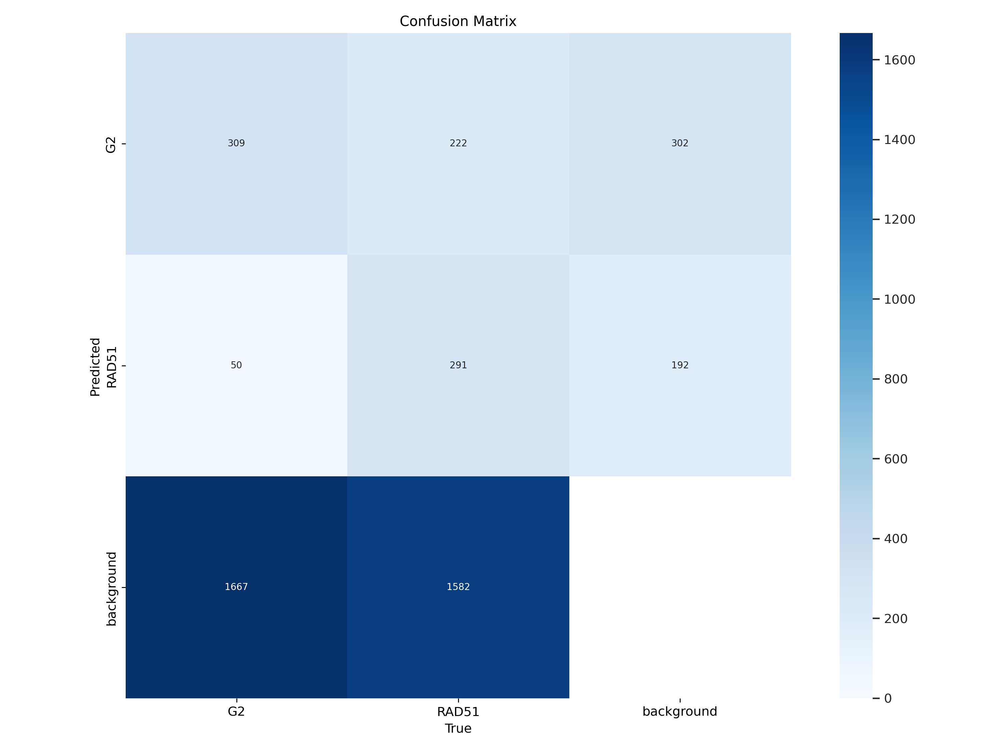

# HRD-related cellular phenotype prediction 🔬

**AI-based Detection and Classification of HRD-related Cellular Phenotypes in Ovarian Cancer**

This project provides an AI-driven tool to automate HRD-related cellular phenotype analysis from fluorescence microscopy images. The system assists clinicians in assessing tumor sensitivity to platinum-based chemotherapy in ovarian cancer.

---

## 📈 Abstract

Homologous recombination deficiency (HRD) is a crucial genomic biomarker used to determine tumor sensitivity to platinum-based chemotherapy. Traditional HRD scoring involves manual fluorescence microscopy evaluation, which is labor-intensive, subjective, and prone to inter-observer variability.

We propose a deep learning-based pipeline that uses YOLOv8 with SAHI slicing to detect nuclei candidates and a hybrid CNN feature fusion model to classify nuclei into Cancer or G2-phase using both image features and biological markers. The system enables automated, reproducible HRD-related cellular phenotype analysis from fluorescence microscopy images.

---

## ⚙️ Tech Stack

* **Backend**: FastAPI
* **Frontend**: Streamlit
* **Model**: YOLOv8 (Ultralytics)
* **Libraries**: PyTorch, OpenCV, NumPy, Pillow, SAHI
* **Annotation Tool**: Napari
* **Training Platform**: Kaggle

---

## 📁 Directory Structure

```
hrd-score-predictor/
|
|-- app/
|   |
|   |-- Dashboard/                     # Streamlit Frontend Dashboard
|   |   |-- Dockerfile
|   |   |-- dashboard.py
|   |   `-- requirements.txt
|   |
|   |-- models/                        # Model Weights and Preprocessing Files
|   |   |-- medical_model_silu.pth
|   |   |-- scaler.pkl
|   |   `-- yolo_best.pt
|   |
|   |-- src/                           # Core ML and Inference Logic
|   |   |-- __init__.py
|   |   |-- architecture.py            # Hybrid CNN Model Architecture
|   |   |-- features.py                # Biological Feature Extraction
|   |   `-- inference.py               # Inference Pipeline
|   |
|   |-- Dockerfile                     # Backend Docker Config
|   |-- main.py                        # FastAPI Entry Point
|   `-- requirements.txt               # Backend Dependencies
|
|-- dataset_sample/                    # Sample Dataset Images
|   |-- Sample_Raw.png
|   |-- Sample_annotation.png
|   `-- Sample_output.png
|
|-- train_logs/                        # Training Metrics and Visualizations
|   |-- confusion_matrix.png
|   |-- results.csv
|   `-- results.png
|
`-- README.md


```


````
---

## How to Run Locally

### 1. Clone the Repository

```bash
git clone https://github.com/subham99kr/HRD-Score-predictor.git
cd HRD-Score-predictor/app
````

### 2. Create Environment and Install Dependencies

```bash
conda create -n hrd-env python=3.10
conda activate hrd-env

pip install -r requirements.txt
pip install -r Dashboard/requirements.txt
```

### 3. Run the Backend API

```bash
uvicorn main:app --reload
```

Visit:

```
http://127.0.0.1:8000
```

---

### 4. Run the Dashboard (Optional)

Open a new terminal:

```bash
cd HRD-Score-predictor/app/Dashboard
streamlit run dashboard.py
```

---

## Model Details

### Detection Model (Stage 1)

| Parameter       | Value                                        |
| --------------- | -------------------------------------------- |
| Model           | YOLOv8s                                      |
| Task            | Nuclei Detection (Bounding Box Localization) |
| Epochs          | 240                                          |
| Optimizer       | AdamW                                        |
| mAP@0.5         | 0.42                                         |
| Precision       | ~0.58 - 0.62                                 |
| Annotation Tool | Napari                                       |

**Role in Pipeline**

* Detects nuclei candidates from fluorescence microscopy images
* Generates bounding boxes for each detected cell
* Acts as the first filtering stage before classification

---

### Classification Model (Stage 2)

| Parameter      | Value                                    |
| -------------- | ---------------------------------------- |
| Model          | Hybrid CNN (HCNN)                        |
| Input          | 64x64 Cell Crop + 23 Biological Features |
| Activation     | SiLU                                     |
| Task           | Cancer vs G2 Classification              |
| Accuracy       | ~0.68                                    |
| Macro F1 Score | ~0.70                                    |

**Role in Pipeline**

* Classifies cells detected by YOLO
* Especially useful for:

  * Low confidence detections
  * Visually ambiguous nuclei
  * Overlapping or noisy fluorescence regions

---

### Overall Pipeline Logic

```
Input Microscopy Image
        |
        v
YOLOv8 + SAHI Small Object Detection
(Bounding Boxes for Cells)
        |
        v
Crop Each Detected Cell
        |
        v
Feature Extraction (23 Biological Features)
        |
        v
Hybrid CNN Classification
(Cancer or G2)
```

---

### End-to-End System Behavior

* YOLO identifies and localizes potential nuclei
* Low confidence or ambiguous detections are further validated using HCNN classification
* Final output provides cell-level phenotype prediction

---

### Practical System Strength

* Combines spatial detection + biological feature reasoning
* Reduces manual nucleus classification workload
* Improves robustness in noisy fluorescence imaging


---
## 📊 Example Images

<table>
  <tr>
    <td align="center">
      
      <br><sub><b>Raw Input</b></sub>
    </td>
    <td align="center">
      
      <br><sub><b>Annotated Image</b></sub>
    </td>
    <td align="center">
      
      <br><sub><b>Model Output</b></sub>
    </td>
    <td align="center">
      
      <br><sub><b>Confusion Matrix</b></sub>
    </td>
  </tr>
</table>


---

## 📊 Dataset Summary

* **Images**: 45
* **Split**: 30 train / 6 validation / 9 test
* **Time Points**: 0 hrs, 3–4 hrs IR, 24 hrs IR
---

## Limitations

* Small dataset size (45 images) limits model generalization and robustness.
* Detection errors from YOLO propagate to the classification stage since missed cells cannot be recovered.
* Small and densely clustered nuclei reduce detection recall, especially for G2 phase cells.
* Fluorescence intensity variations can affect feature extraction consistency.
* Current model is trained on limited experimental conditions and may not generalize to all microscopy setups.
* Lack of large-scale clinical validation across multiple labs and imaging devices.

---

## Future Scope

* Expand dataset size with multi-center clinical data.
* Improve detection using larger YOLO variants or ensemble detection models.
* Introduce semi-supervised or self-supervised learning to leverage unlabeled microscopy data.
* Add uncertainty estimation for clinical decision support.
* Optimize pipeline for real-time hospital deployment.
* Perform clinical trial validation with oncological research labs.
* Extend pipeline to support HRD-related analysis in other cancer types.
* Explore transformer-based architectures for multi-modal feature fusion.

---


## 📂 References

* [DeepHRD Paper](https://www.medrxiv.org/content/10.1101/2023.02.23.23285869v1)
* [YOLOv8 Paper](https://arxiv.org/abs/2408.15857)

---

## 👨‍💻 Team

Final Year B.Tech (EE), IIT (ISM) Dhanbad:

* **Subham Kumar (21JE0947)**
* Ayush Chauhan (20JE0230)
* Siddhant Jha (21JE0917)
* Supriya Kumari (21JE0970)
* Surbhi Kumari (21JE0973)

**Guide**: Prof. Haswanth Vundavilli

---

## 📄 Report & Poster

* [Final Report](https://drive.google.com/file/d/1ooyxb8_HnUuxbQamZZd9kJCbF32uv9HG/view?usp=drive_link)

---

## 🚫 License

This project is for academic and research use only.

