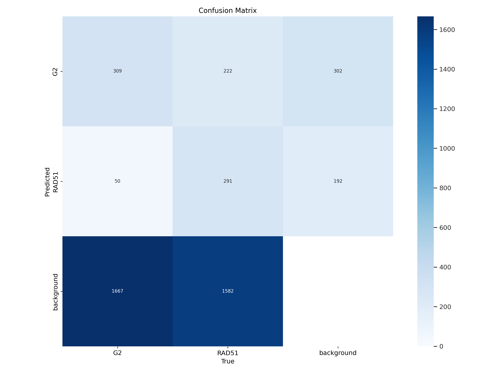

# HRD Score Predictor 🔬

**Prediction of Homologous Recombination Scores Using AI Models for Ovarian Cancer Diagnosis**

This project provides an AI-driven tool to automate the prediction of Homologous Recombination Deficiency (HRD) scores from fluorescence microscopy images. The system assists clinicians in assessing tumor sensitivity to platinum-based chemotherapy in ovarian cancer.

---

## 📈 Abstract

Homologous recombination deficiency (HRD) is a crucial biomarker used to determine the effectiveness of platinum-based chemotherapy. Traditional HRD scoring is labor-intensive and prone to variability. We propose a deep learning-based method using YOLOv8 to detect RAD51+ and G2-phase nuclei from cell images and compute the HR score automatically.

---

## ⚙️ Tech Stack

* **Backend**: FastAPI
* **Frontend**: HTML, JavaScript
* **Model**: YOLOv8 (Ultralytics)
* **Libraries**: PyTorch, OpenCV, NumPy, Pillow
* **Annotation Tool**: Napari
* **Training Platform**: Kaggle

---

## 📁 Directory Structure

```
📁 hrd-score-predictor/
├── 📁 app/                      # Backend (FastAPI + YOLOv8)
│   ├── app.py                  # FastAPI code
│   ├── requirements.txt        # Python dependencies
│   ├── best.pt                 # YOLOv8 best model
│   ├── last.pt                 # (Optional) last checkpoint
│   └── Dockerfile              # Docker build file
│
├── 📁 frontend/                 # Optional: frontend (HTML/JS)
│   └── index.html              # Upload + display form
│
├── 📁 train_logs/              # YOLO training metrics
│   ├── results.png             # mAP, loss curves
│   ├── confusion_matrix.png    # Confusion matrix 
│   ├── metrics.csv             # Raw logs 
│   
├── 📁 dataset_sample/          # Sample test image(s) 
│   └── test_image_1.png
│
├── .gitignore
├── README.md                   # Full project description
```

---

## 🚀 How to Run Locally

### 1. Clone the Repository

```bash
git clone https://github.com/subham99kr/HRD-Score-predictor.git
cd HRD-Score-predictor
```

### 2. Create Environment & Install Dependencies

```bash
conda create -n hrd-env python=3.10
conda activate hrd-env
pip install -r requirements.txt
```

### 3. Run the App

```bash
cd app
uvicorn app:app --reload
```

Visit `http://127.0.0.1:8000` in your browser.

---

## 🧠 Model Details

| Parameter       | Value   |
| --------------- | ------- |
| Architecture    | YOLOv8s |
| Epochs          | 240     |
| Optimizer       | AdamW   |
| mAP\@0.5        | 0.32    |
| Precision       | \~50%   |
| Annotation Tool | Napari  |

---

## 📊 Example Images

* **Raw Input**: `Sample_Raw.png`
* **Annotated**: `Sample_annotation.png`
* **Model Output**: `Sample_output.png`
* **Confusion Matrix**: `confusion_matrix.png`





---

## 📊 Dataset Summary

* **Images**: 45
* **Split**: 30 train / 6 validation / 9 test
* **Time Points**: 0 hrs, 3–4 hrs IR, 24 hrs IR

---

## 📌 Limitations

* Low recall for G2 due to small object size
* Only 45 images used for training
* Needs real clinical validation

---

## 🔮 Future Scope

* Expand dataset to other cancers
* Add semi-supervised learning
* Real-time hospital deployment
* Clinical trial validation

---

## 📂 References

* [DeepHRD Paper](https://www.medrxiv.org/content/10.1101/2023.02.23.23285869v1)
* [YOLOv8 Paper](https://arxiv.org/abs/2408.15857)

---

## 👨‍💻 Team

Final Year B.Tech (EE), IIT (ISM) Dhanbad:

* **Subham Kumar (21JE0947)**
* Ayush Chauhan (20JE0230)
* Siddhant Jha (21JE0917)
* Supriya Kumari (21JE0970)
* Surbhi Kumari (21JE0973)

**Guide**: Prof. Haswanth Vundavilli

---

## 📄 Report & Poster

* [Final Report](https://drive.google.com/file/d/1ooyxb8_HnUuxbQamZZd9kJCbF32uv9HG/view?usp=drive_link)

---

## 🚫 License

This project is for academic and research use only.
